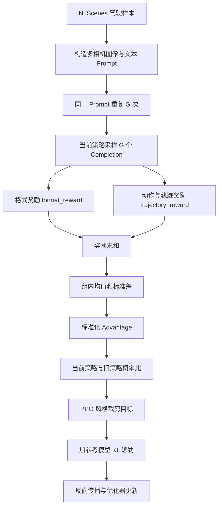

# VGGDrive 仓库中的 GRPO 训练流程

本文结合仓库中的实际代码，说明 GRPO（Group Relative Policy Optimization）如何用于自动驾驶视觉语言模型训练。重点回答四个问题：

1. 一个驾驶样本如何变成多模态 prompt；
2. 模型如何为同一场景生成一组候选驾驶答案；
3. 轨迹奖励和格式奖励如何变成 advantage；
4. advantage 如何通过 GRPO loss 更新模型。

> 说明：本文描述的是仓库当前实现，而不是一份抽象的 GRPO 教科书。第 11 节列出了当前代码中影响直接运行和 VGGDrive/CVGE 训练的若干问题。

## 1. 相关文件

| 文件 | 作用 |
|---|---|
| `open_r1/recipes/grpo_ad.py` | 训练入口、输出格式奖励、动作与轨迹奖励 |
| `open_r1/trainer/grpo_trainer.py` | GRPO Trainer：生成、打分、组内归一化、loss 计算 |
| `open_r1/trainer/grpo_config.py` | GRPO 超参数，如 `num_generations`、`beta`、`epsilon` |
| `open_r1/dataloader/nuscenes_planning_grpo.py` | 将 NuScenes 驾驶样本转换为图像、prompt 和奖励标签 |
| `open_r1/dataloader/nuscenes_planning.py` | NuScenes 数据读取、缓存和样本预处理 |
| `local_scripts/zero3.yaml` | Accelerate + DeepSpeed ZeRO-3 配置 |

训练入口最终执行：

```python
trainer = Qwen2VLGRPOTrainer(...)
trainer.train(resume_from_checkpoint=checkpoint)
trainer.save_model(training_args.output_dir)
```

对应代码位于 `open_r1/recipes/grpo_ad.py:440-477`。

## 2. GRPO 在这里解决什么问题

SFT 使用标准答案逐 token 计算交叉熵。GRPO 不要求每个生成 token 都有监督标签，而是让模型生成完整答案，然后用任务规则对整个答案评分。

对一个驾驶场景，模型需要输出类似：

```text
<think>前方车辆减速，应保持安全距离。</think>
<lateral_control>Go Straight</lateral_control>
<longitudinal_control>Decelerate</longitudinal_control>
<trajectory>[[0.5, 0.0], [1.0, 0.0], ..., [3.0, 0.1]]</trajectory>
```

仓库会为同一个场景采样 `G = num_generations` 个答案，然后比较这 `G` 个答案的：

- 输出格式是否正确；
- 横向和纵向动作是否合理、是否匹配真值；
- 六个轨迹点是否合法；
- 预测轨迹和真值轨迹的 ADE 是否足够小。

组内表现高于平均值的答案得到正 advantage，低于平均值的答案得到负 advantage。训练会提高高 advantage 答案的生成概率，降低低 advantage 答案的生成概率。

## 3. 总体流程



这里没有单独训练一个 value/critic 网络。GRPO 使用同组候选答案的平均奖励作为相对基线，因此比传统 PPO 少一个价值模型。

## 4. 训练初始化

### 4.1 选择奖励函数

`grpo_ad.py` 注册了两个默认奖励函数：

```python
reward_funcs_registry = {
    "accuracy": trajectory_reward,
    "format": format_reward,
}

reward_funcs = [
    reward_funcs_registry[name]
    for name in script_args.reward_funcs
]
```

默认 `reward_funcs=["accuracy", "format"]`，所以一个 completion 的最终奖励是：

```text
总奖励 = trajectory_reward + format_reward
```

### 4.2 创建策略模型和参考模型

训练入口把 `model_name_or_path` 作为字符串传给 `Qwen2VLGRPOTrainer`：

```python
trainer = Qwen2VLGRPOTrainer(
    model=model_args.model_name_or_path,
    reward_funcs=reward_funcs,
    args=training_args,
    train_dataset=dataset,
    ...
)
```

Trainer 根据模型路径名称加载 Qwen2-VL 或 Qwen2.5-VL：

```python
if "Qwen2.5-VL" in model_id:
    model = Qwen2_5_VLForConditionalGeneration.from_pretrained(...)
```

它还会准备一个冻结的参考策略 `ref_model`：

- 非 PEFT 训练：复制初始策略作为参考模型；
- PEFT/LoRA 训练：关闭 adapter 后的基础模型充当参考模型；
- DeepSpeed ZeRO-3：重新加载并用 DeepSpeed 包装参考模型。

参考模型不参与优化，用于限制训练后的策略不要偏离初始模型过远。

### 4.3 LoRA 和视觉模块冻结

如果传入 PEFT 配置，Trainer 会收集非视觉模块中的 `Linear` 层作为 LoRA target：

```python
self.vision_modules_keywords = ["visual"]
target_modules = find_all_linear_names(model, self.vision_modules_keywords)
model = get_peft_model(model, peft_config)
```

如果设置 `freeze_vision_modules=True`，名称中包含 `visual` 的参数会被冻结。

## 5. 数据如何进入 GRPO

### 5.1 单个数据样本

`NuScenesPlanningGRPODataset.__getitem__()` 返回：

```python
{
    "message": message,                 # 多相机图像 + 驾驶问题
    "lat_action": lat_action,           # 横向动作真值
    "lon_action": lon_action,           # 纵向动作真值
    "trajectory": fut_trajectory,       # 未来六个轨迹点
    "image_inputs": image_inputs,       # Qwen-VL 图像输入
    "video_inputs": video_inputs,
}
```

其中 `message` 是 Qwen-VL chat 格式：

```python
message = [
    {
        "role": "user",
        "content": [
            {"type": "image", "image": "file:///.../cam_front_left.jpg"},
            {"type": "image", "image": "file:///.../cam_front.jpg"},
            {"type": "image", "image": "file:///.../cam_front_right.jpg"},
            {"type": "text", "text": prompt},
        ],
    }
]
```

`lat_action`、`lon_action` 和 `trajectory` 不直接输入模型，而是在生成完成后交给奖励函数。

### 5.2 为什么同一个样本要重复 G 次

`RepeatRandomSampler` 会把每个样本索引连续重复 `num_generations` 次：

```python
for index in chunk:
    for _ in range(self.num_generations):
        yield index
```

例如：

```text
原始索引：     [17, 42]
num_generations = 4
采样后索引：   [17, 17, 17, 17, 42, 42, 42, 42]
```

由于生成使用 `do_sample=True`，即使 prompt 完全相同，每次也可能采样出不同的 completion，由此构成同一 prompt 的候选组。

Trainer 要求：

```text
全局 batch size % num_generations == 0
```

例如在梯度累积为 1 时，8 张 GPU、每卡 batch size 为 1，则全局 batch size 为 8，可令 `num_generations=8`。每一步全局处理一个驾驶场景的八个候选答案。

## 6. 生成候选答案

核心代码位于 `_generate_and_score_completions()`。

### 6.1 多模态编码

```python
text_list = [
    processor.apply_chat_template(
        message,
        tokenize=False,
        add_generation_prompt=True,
    )
    for message in messages
]

prompt_inputs = processor(
    text=text_list,
    images=image_inputs,
    padding=True,
    padding_side="left",
    return_tensors="pt",
)
```

Processor 产生：

- `input_ids`：文本和图像占位 token；
- `attention_mask`：prompt 的有效 token mask；
- `pixel_values`：预处理后的图像；
- `image_grid_thw`：Qwen2.5-VL 的视觉网格信息。

### 6.2 自回归采样

```python
self.generation_config = GenerationConfig(
    max_new_tokens=self.max_completion_length,
    do_sample=True,
    temperature=1,
    pad_token_id=pad_token_id,
)

prompt_completion_ids = model.generate(
    **prompt_inputs,
    generation_config=self.generation_config,
)
```

输出随后被分成：

```text
prompt_completion_ids = prompt_ids + completion_ids
```

代码找到每个 completion 的第一个 EOS，并构造 `completion_mask`。EOS 后的 padding token 不参与策略 loss、KL 和长度统计。

## 7. 奖励如何计算

### 7.1 格式奖励 `format_reward`

格式奖励鼓励模型严格输出四个区块：

```text
<think>...</think>
<lateral_control>...</lateral_control>
<longitudinal_control>...</longitudinal_control>
<trajectory>...</trajectory>
```

奖励由以下部分组成：

| 子项 | 当前代码逻辑 |
|---|---|
| 标签存在 | 每个完整区块奖励 `0.15`，四个最多 `0.6` |
| 标签次数 | 每组开闭标签恰好一次奖励 `0.0125`，重复则惩罚 `-0.125` |
| 轨迹格式 | 六个二维数值点奖励 `0.5`，非法格式惩罚 |
| 标签外文本 | 没有额外文本奖励 `0.2`，额外文本越长奖励越低 |
| 区块顺序 | `think` 在三个最终答案区块之前时奖励 `0.1` |

最后将各子项直接相加：

```python
final_rewards = [
    tag_reward
    + trajectory_format_reward
    + tag_count_reward
    + outside_text_reward
    + order_reward
]
```

### 7.2 任务奖励 `trajectory_reward`

代码从 completion 中解析：

```python
preds["lateral_control"]
preds["longitudinal_control"]
preds["trajectory"]
```

动作部分包含两类奖励：

1. 输出是否属于允许的动作类别；
2. 输出动作是否与该样本的真值动作匹配。

轨迹必须为六个二维点：

```python
[
    [x1, y1],
    [x2, y2],
    ...,
    [x6, y6],
]
```

代码分别计算未来 1、2、3 秒的 ADE：

```python
ADE_s = mean(norm(pred[:2*s] - gt[:2*s]))
```

对应奖励为：

```python
def trajectory_reward_func(ade, split_point):
    if ade < split_point:
        return 1 / (1 + ade)
    return 1 / (1 + split_point + 2 * (ade - split_point))
```

三个时间范围采用不同阈值和权重：

| 范围 | 点数 | 阈值 | 权重 |
|---|---:|---:|---:|
| 未来 1 秒 | 2 | 0.4 | 2.00 |
| 未来 2 秒 | 4 | 1.6 | 3.00 |
| 未来 3 秒 | 6 | 2.4 | 3.66 |

这使轨迹越接近真值，奖励越高；超过阈值后，奖励下降得更快。轨迹无法解析或不是六个二维点时，任务奖励减 `0.4`。

### 7.3 多奖励合并

Trainer 为每个 completion 计算二维奖励矩阵：

```text
rewards_per_func.shape = [batch_size, num_reward_functions]
```

然后跨 GPU 收集并直接求和：

```python
rewards_per_func = accelerator.gather(rewards_per_func)
rewards = rewards_per_func.sum(dim=1)
```

因此当前实现的总奖励公式是：

```text
r_i = r_trajectory(i) + r_format(i)
```

## 8. 从奖励得到组内 Advantage

假设同一个场景生成 `G` 个 completion，它们的总奖励为：

```text
r_1, r_2, ..., r_G
```

代码计算组内均值和标准差：

```python
group_mean = rewards.view(-1, G).mean(dim=1)
group_std = rewards.view(-1, G).std(dim=1)

advantages = (
    rewards - group_mean.repeat_interleave(G)
) / (
    group_std.repeat_interleave(G) + 1e-4
)
```

即：

```text
A_i = (r_i - mean(r_1...r_G)) / (std(r_1...r_G) + 1e-4)
```

举例：同一场景四个答案的奖励为：

```text
[8.0, 6.0, 4.0, 2.0]
```

那么前两个答案得到正 advantage，后两个得到负 advantage。这里关心的是同一场景内的相对好坏，而不是不同场景奖励的绝对尺度。

## 9. GRPO loss 如何更新模型

核心代码位于 `Qwen2VLGRPOTrainer.compute_loss()`。

### 9.1 计算 completion token 的 log probability

完整输入为：

```python
input_ids = torch.cat([prompt_ids, completion_ids], dim=1)
```

模型输出每个位置对词表的 logits。代码通过 `log_softmax + gather` 取出实际生成 token 的 log probability：

```python
log_probs = logits.log_softmax(dim=-1)
token_log_prob = gather(log_probs, generated_token_id)
```

随后去掉 prompt 部分，只保留 completion：

```python
per_token_logps = per_token_logps[:, prompt_length - 1:]
```

### 9.2 策略概率比与裁剪

对 completion 的每个 token，定义当前策略与旧策略的概率比：

```text
ratio_t = exp(log pi_theta(token_t) - log pi_old(token_t))
```

代码为：

```python
ratio = torch.exp(per_token_logps - old_per_token_logps)
clipped_ratio = torch.clamp(ratio, 1 - epsilon, 1 + epsilon)
```

然后计算 PPO 风格的裁剪目标：

```python
loss_1 = ratio * advantage
loss_2 = clipped_ratio * advantage
policy_loss = -torch.min(loss_1, loss_2)
```

`epsilon` 默认是 `0.2`，所以单次更新中 ratio 通常被限制在 `[0.8, 1.2]` 的有效范围，避免策略一步变化过大。

### 9.3 参考模型 KL 惩罚

当 `beta > 0` 时，代码计算当前策略相对参考策略的逐 token KL 估计：

```python
delta = ref_per_token_logps - per_token_logps
per_token_kl = torch.exp(delta) - delta - 1

per_token_loss = policy_loss + beta * per_token_kl
```

`beta` 默认是 `0.04`：

- `beta` 较大：模型更接近初始/SFT 模型，训练稳定但探索较弱；
- `beta` 较小：模型更积极地优化驾驶奖励，但更容易发生语言能力退化或 reward hacking。

### 9.4 聚合最终 loss

只对 EOS 之前的 completion token 计算损失：

```python
loss = (
    (per_token_loss * completion_mask).sum(dim=1)
    / completion_mask.sum(dim=1)
).mean()
```

也就是：

1. 一个 completion 内对有效 token 求平均；
2. 再对 batch 中所有 completion 求平均。

`compute_loss()` 返回这个标量后，父类 `transformers.Trainer` 负责：

- 调用 Accelerate/DeepSpeed 反向传播；
- 梯度累积；
- 梯度裁剪；
- optimizer step 和 scheduler step；
- checkpoint 与日志保存。

## 10. 一次训练 step 的等价伪代码

下面的伪代码把仓库中分散在 Dataset、Sampler、Trainer 和 reward 函数里的逻辑合在一起：

```python
for prompt_group in dataloader:
    # 1. 一个 prompt 已由 sampler 重复 G 次
    completions = policy.generate(
        prompt_group,
        do_sample=True,
        max_new_tokens=max_completion_length,
    )

    # 2. 为每个候选答案计算任务奖励和格式奖励
    rewards = []
    for completion in completions:
        reward = trajectory_reward(completion, ground_truth)
        reward += format_reward(completion)
        rewards.append(reward)

    # 3. 同一 prompt 的 G 个结果做组内标准化
    advantages = normalize_within_group(rewards)

    # 4. 计算当前、旧策略和参考策略的逐 token log probability
    logp = policy.log_prob(completions)
    old_logp = old_policy.log_prob(completions)
    ref_logp = reference_policy.log_prob(completions)

    # 5. PPO 风格裁剪目标
    ratio = exp(logp - old_logp)
    clipped_ratio = clip(ratio, 1 - epsilon, 1 + epsilon)
    policy_loss = -min(
        ratio * advantages,
        clipped_ratio * advantages,
    )

    # 6. 限制策略偏离参考模型
    loss = policy_loss + beta * kl(policy, reference_policy)

    # 7. Trainer + Accelerate + DeepSpeed 完成更新
    loss.backward()
    optimizer.step()
    optimizer.zero_grad()
```

## 11. 当前仓库实现需要注意的问题

以下内容是理解和复现时必须注意的实际代码状态。

### 11.1 当前入口没有加载 VGGDrive 的 CVGE 自定义模型

`grpo_ad.py` 将模型路径字符串传给 Trainer，而 `grpo_trainer.py` 使用标准：

```python
Qwen2_5_VLForConditionalGeneration.from_pretrained(...)
```

它没有使用：

```python
CustomQwen2_5_VLForConditionalGeneration
```

因此当前入口训练的是标准 Qwen2.5-VL GRPO，而不是带 VGGT/CVGE 注入的完整 VGGDrive。若要训练 VGGDrive，需要至少：

1. 在入口中实例化 `inject_utils/Qwen2_5_vggt_fusion_inject_cam.py` 的自定义模型；
2. 把模型对象而非路径字符串传给 Trainer；
3. Dataset/Trainer 继续传递 `img_list` 和 `cam2lidar`；
4. 修改 `_get_per_token_logps()` 和 `generate()` 调用，让自定义模型在生成和重新计算 log probability 时都接收到这些输入；
5. 确认参考模型采用相同结构。

### 11.2 纵向动作合法性检查使用了错误的类别表

当前代码为：

```python
is_in_gt(preds["longitudinal_control"], lateral_control_gt)
```

这里应当使用 `longitudinal_control_gt`。否则合法的 `Accelerate`、`Decelerate` 等纵向动作可能被错误惩罚。

### 11.3 `beta=0` 分支会继续索引空对象

代码在 `beta == 0` 时把 `ref_per_token_logps` 设为 `None`，但后面仍无条件执行切片：

```python
ref_per_token_logps = ref_per_token_logps[:, prompt_length - 1:]
```

因此当前实现不能直接通过 `beta=0` 关闭 KL，需要先给切片操作增加非空判断。

### 11.4 部分配置参数没有真正生效

- `args.temperature` 没有用于生成；生成温度被硬编码为 `1`；
- `reward_weights` 已在配置中定义，但奖励仍使用无权重 `sum(dim=1)`；
- `max_prompt_length` 被强制设为 `None`，不执行 prompt 截断；
- `ds3_gather_for_generation` 在本 Trainer 中没有显式使用。

### 11.5 Dataset 初始化属性不完整

`NuScenesPlanningGRPODataset.__getitem__()` 使用：

```python
self.query_prompt_type
self.dataroot
self.resize_kwargs
```

但父类当前并未完整、稳定地初始化这些属性，尤其是直接从 cache 文件加载的分支。运行前需要在 Dataset 初始化中显式设置：

```python
self.query_prompt_type = data_args.query_prompt_type
self.dataroot = data_path
self.resize_kwargs = {
    "resized_height": data_args.re_height,
    "resized_width": data_args.re_weight,
}
```

### 11.6 设备被硬编码为 CUDA

生成输入使用：

```python
prompt_inputs = prompt_inputs.to("cuda")
```

更稳妥的写法是：

```python
prompt_inputs = prompt_inputs.to(self.accelerator.device)
```

这样才能正确适配每个分布式进程的设备，也便于 CPU/其他加速器调试。

## 12. 关键超参数

| 参数 | 默认值 | 含义 |
|---|---:|---|
| `num_generations` | 8 | 每个 prompt 的候选答案数量 G |
| `max_completion_length` | 256 | 最多生成 token 数 |
| `learning_rate` | `1e-6` | GRPO 学习率 |
| `beta` | 0.04 | 参考模型 KL 惩罚系数 |
| `epsilon` | 0.2 | 策略概率比裁剪范围 |
| `num_iterations` | 1 | 一批生成结果重复优化的次数 |
| `gradient_accumulation_steps` | 继承训练参数 | 梯度累积步数 |
| `freeze_vision_modules` | False | 是否冻结 Qwen 视觉模块 |

建议先使用：

```text
num_generations = 全局 batch size
num_iterations = 1
beta = 0.04
epsilon = 0.2
learning_rate = 1e-6
```

在确认奖励、分组顺序和训练指标正确后，再提高 `num_iterations` 或调节奖励权重。

## 13. 应重点监控的指标

Trainer 当前记录：

| 指标 | 含义 |
|---|---|
| `rewards/trajectory_reward` | 动作和轨迹任务奖励均值 |
| `rewards/format_reward` | 格式奖励均值 |
| `reward` | 总奖励均值 |
| `reward_std` | 组内奖励标准差 |
| `completion_length` | 平均生成长度 |
| `kl` | 当前策略相对参考策略的偏离程度 |
| `clip_ratio` | 被裁剪 token 的比例 |

判断训练是否健康时，不应只看总奖励：

- `reward` 上升但 `format_reward` 下降，可能说明模型牺牲格式来优化轨迹；
- `reward_std` 长期接近 0，组内候选缺少差异，advantage 信号会很弱；
- `kl` 快速增大，说明策略偏离初始模型过快；
- `clip_ratio` 长期很高，通常说明学习率过大或重复更新次数过多；
- 轨迹奖励提高但实际评测不提高，可能存在 reward hacking，需要检查解析和奖励函数。

## 14. 总结

这个仓库的 GRPO 训练可以概括为：

```text
驾驶图像与问题
  -> 同一场景采样多个结构化驾驶答案
  -> 用动作、ADE 和格式规则评分
  -> 在同一场景的候选答案内计算相对 advantage
  -> 用裁剪策略目标提高好答案概率、降低差答案概率
  -> 用参考模型 KL 防止策略漂移
  -> Transformers Trainer + Accelerate + DeepSpeed 完成分布式更新
```

其中最核心的对应关系是：

| GRPO 概念 | 仓库实现 |
|---|---|
| 一组候选答案 | `RepeatRandomSampler` + `generate(do_sample=True)` |
| 奖励函数 | `trajectory_reward`、`format_reward` |
| 相对 advantage | `rewards.view(-1, G)` 后组内标准化 |
| 旧策略约束 | `old_per_token_logps` + ratio clipping |
| 参考策略约束 | `ref_per_token_logps` + `beta * KL` |
| 参数更新 | `Qwen2VLGRPOTrainer.compute_loss()` 返回 loss，由父 Trainer 反向传播 |
